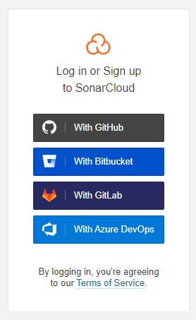
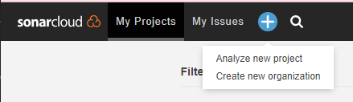
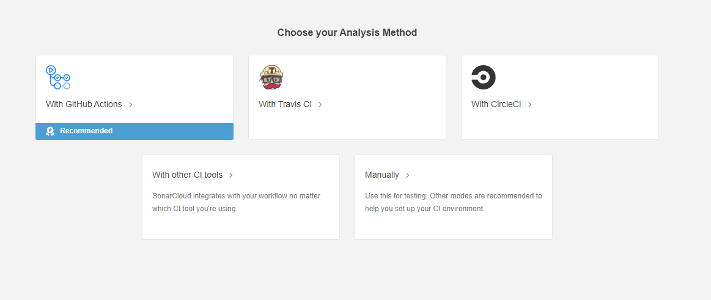

# pttgc-devops-lab03
This module will help attendees to understand and be able to integrate their DevOps workflows with SonarCloud to perform code quality check.

From the previous lab `pttgc -devops-lab02` the workflow still missing the Code Quality Scan. We will be focusing on this topic in this lab. The Code Quality Scan that we will use for this lab is `SonarCloud` which is equivalent to `SonarQube` or the solution from `Azure`.

## Exercise 1 - Create workflow that integrate with SonarCloud

Attendee has two options which are
- Create the new repository, e.g. `devops-lab03` and copy the folder `src` and `Dockerfile` *(optional)* to the new repository, or
- Use the previous repository `devops-lab02` 

- Go to  [https://sonarcloud.io/](https://sonarcloud.io/)
- Click Login, then login or signup with `GitHub`




- On the top left corner, click the plus sign `+` and `Analys New Project`




- Select your repository and then click `Setup`
- Choose analysis method as `GitHub Action`



- Ensure that you copy the secret to somewhere safe, we will use this later
- For the step 2, `create or update .github/workflow/build.yaml`, we can ignore this step for now, we will create our own workflow
- Step 3, copy the content of file `sonar-project.properties` and create this file in your repository.
- Next, create workflow file name `devops-lab03.yaml` inside `.github/workflows` directory
```yaml
name: Code Quality Workflow
on:
  push:
    branches:
      - main

jobs:
  sonarcloud:
    name: SonarCloud
    runs-on: ubuntu-latest
    steps:
      - uses: actions/checkout@v2
        with:
          fetch-depth: 0
      - name: SonarCloud Scan
        uses: SonarSource/sonarcloud-github-action@master
        env:
          SONAR_TOKEN: <Your token>
```
- Commit and push the code, and go to GitHub UI to see how your workflow is running
- Go back to [https://sonarcloud.io/](https://sonarcloud.io/) and check your project for more information about your code quality

*NOTE: We deliberately put the token to the workflow file which is a serious mistake in term of security perspective, and this topic will discuss further in the next lab*
